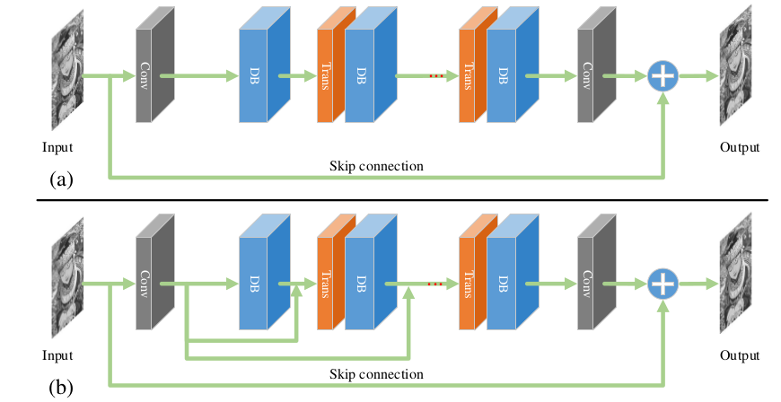
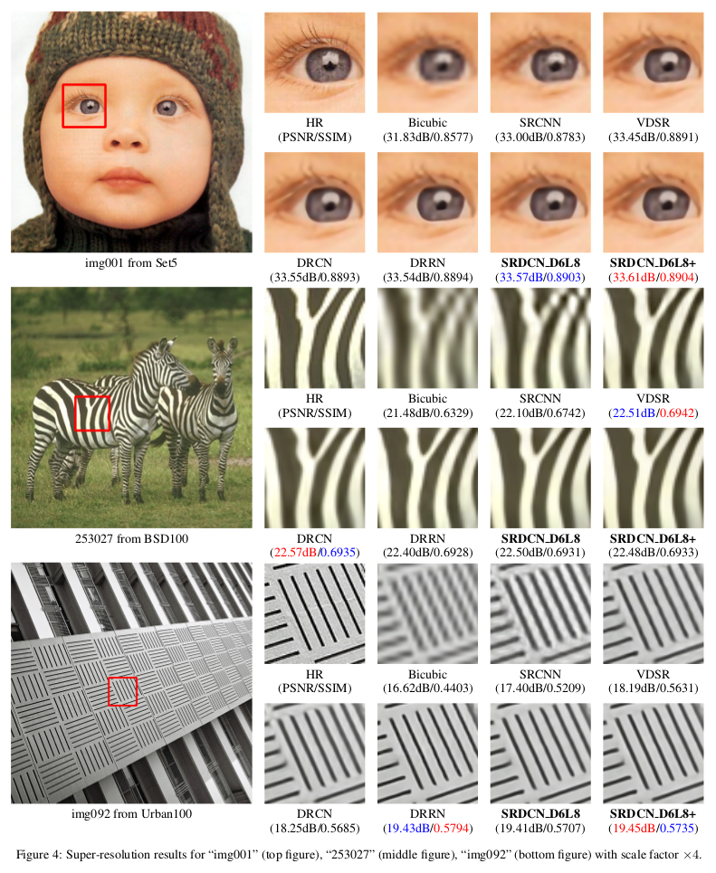
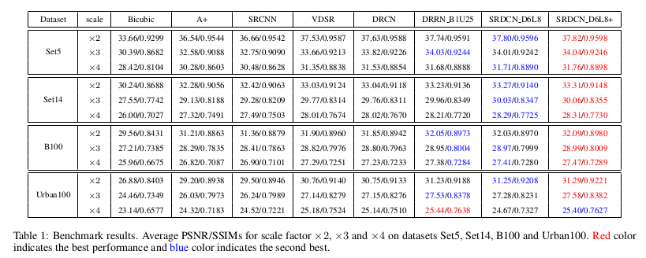

# SRDCN

## Single Image Super-Resolution Based on Dense Convolutional Network

This is an implementation of SRDCN for single image super-resolution.

### Model Architectural

	

 

	(a) Basic network structure. (b) Enhanced model with dense skip connection.

### Result

	

	

